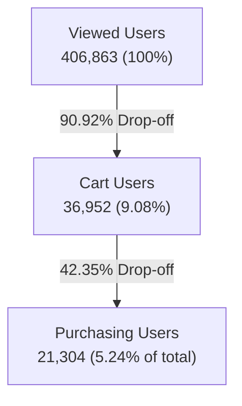

# E-Commerce Customer Behavior & Funnel Analysis

An end-to-end data analytics project focused on understanding user interaction behavior, quantifying funnel performance, segmenting customer purchase patterns, and providing actionable strategic recommendations to optimize sales and conversion for an e-commerce platform.

---

## 📌 Project Overview

In modern e-commerce, driving traffic to a site is only half the battle. Maximizing revenue requires a deep, quantitative understanding of the customer journey—from the initial product discovery (views) to cart interactions and, ultimately, purchase completion.

This project explores user activity on an e-commerce platform using event-level data. By parsing, cleaning, and aggregating raw interaction events, the project reveals exactly where users drop off in the conversion funnel, identifies high-performing products, brands, and categories, segments users based on purchase intent, and exposes critical catalog data gaps.

---

## 🎯 Business Goals & Core Questions

The primary goal of this case study is to **diagnose conversion friction points, identify revenue drivers, and recommend management interventions** to improve overall conversion and customer lifetime value (LTV).

The analysis is structured to answer seven critical business questions:

1. **Funnel Performance:** How many unique users view products, add items to carts, and complete purchases?
2. **Merchandising Drivers:** Which specific products, brands, and product categories drive the highest volume of purchases and revenue?
3. **Temporal Patterns:** Which months, days, and hours exhibit the highest platform activity and transaction volumes?
4. **Funnel Drop-offs:** Where is the largest percentage drop-off in the user purchasing journey?
5. **Cart Abandonment:** Which users show high intent (adding to cart) but fail to complete a purchase, and what brands do they abandon?
6. **Catalog Incompleteness:** To what extent are missing attributes (e.g., brand, category) impacting reporting quality and business decisions?
7. **Strategic Interventions:** What concrete, high-priority actions should management implement to increase sales?

---

## 📊 Dataset Properties

The primary data source is `events.csv`, an event-level dataset where each row captures a single user action on the platform.

### Data Schema

| Column          | Data Type      | Description                                                                    |
| :-------------- | :------------- | :----------------------------------------------------------------------------- |
| `event_time`    | Datetime (UTC) | The precise timestamp when the event occurred.                                 |
| `event_type`    | Categorical    | The action taken by the user (`view`, `cart`, `purchase`).                     |
| `product_id`    | String (ID)    | Unique identifier for the product being interacted with.                       |
| `category_id`   | String (ID)    | Unique identifier for the product category.                                    |
| `category_code` | String (Path)  | Human-readable category breadcrumbs (e.g., `computers.components.videocards`). |
| `brand`         | String         | Brand name of the product (e.g., `msi`, `gigabyte`, `asus`).                   |
| `price`         | Float64        | Price of the product in USD.                                                   |
| `user_id`       | String (ID)    | Unique identifier representing an individual customer.                         |
| `user_session`  | String (UUID)  | Unique identifier grouping events in a single browsing session.                |

### Data Volume & Shapes

- **Raw Volume:** Over 100+ MB of raw event logs.
- **Starting Point:** 1,000,000+ raw interaction records before deduplication.
- **Temporal Window:** Late 2020 through early 2021.

---

## 📐 Analytical & KPI Framework

To translate raw transactional logs into business indicators, the following standardized Key Performance Indicators (KPIs) are calculated:

- **Total Users (Reach):** $\text{nunique}(user\_id)$
- **Total Sessions (Visits):** $\text{nunique}(user\_session)$
- **Total Views, Carts, & Purchases:** Event counts grouped by `event_type`.
- **Total Revenue:** $\sum(price \text{ where } event\_type == 'purchase')$.
- **Average Order Value (AOV):** $\frac{\text{Total Revenue}}{\text{Total Purchase Events}}$.
- **User Conversion Rate:** $\frac{\text{Unique Purchasing Users}}{\text{Total Unique Users}}$.
- **View-to-Cart Conversion:** $\frac{\text{Unique Users who Added to Cart}}{\text{Unique Users who Viewed a Product}}$.
- **Cart-to-Purchase Conversion:** $\frac{\text{Unique Users who Purchased}}{\text{Unique Users who Added to Cart}}$.
- **Overall Funnel Conversion:** $\frac{\text{Unique Users who Purchased}}{\text{Unique Users who Viewed a Product}}$.

---

## ⚙️ Data Cleaning & Processing Pipeline

To ensure the integrity of the downstream analysis, a strict cleaning pipeline is executed:

1.  **Deduplication:** Exact duplicates are removed to avoid artificial inflation of KPIs and funnel metrics.
2.  **Price Validation:** Non-positive and zero prices are filtered out (all pricing is confirmed positive).
3.  **Timestamp Standardization:** `event_time` is parsed as UTC-aware datetimes and localized to naive timezone formats for clean aggregation.
4.  **Feature Engineering:** Derived fields are generated for chronological grouping:
    - `event_date` (normalized date)
    - `event_month` (e.g., `2021-01`)
    - `event_day` (ordered categorical factor, e.g., `Monday` $\rightarrow$ `Sunday`)
    - `event_hour` (integer 0–23)
5.  **Null Imputation:** Missing attributes in categorical columns are assigned descriptive strings:
    - Missing `brand` $\rightarrow$ `"Unknown"`
    - Missing `category_code` $\rightarrow$ `"Unknown"`
6.  **Pipeline Quality Control:** The data volume progression is formally audited:
    - _Raw starting points:_ Full dataset ingestion.
    - _Deduplication/price clean:_ Excludes duplicates and bad prices.
    - _Clean data shape:_ Ready for analytical aggregation.

---

## 📈 Key Findings & Analytics Dashboard

### 1. Headline Metrics (Core KPIs)

Based on the finalized data run, the platform's core commercial and behavioral KPIs are:

- **Total Unique Users:** 407,283
- **Total Unique Sessions:** 490,398
- **Total Revenue:** **$5,125,113.92**
- **Total Purchases:** 37,343
- **Average Order Value (AOV):** **$137.24**
- **Overall User Conversion Rate:** **5.23%**
- **View-to-Cart User Rate:** **9.08%**
- **Cart-to-Purchase User Rate:** **57.65%**
- **Cart-to-Purchase Event Rate:** **69.11%**

---

### 2. Funnel drop-off Analysis

A user-level funnel reveals the exact point where customer drop-off is most severe.



| Funnel Stage               | Unique Users | Conversion from Previous Stage | Total Drop-off from Previous | Overall Funnel Share |
| :------------------------- | :----------: | :----------------------------: | :--------------------------: | :------------------: |
| **1. Product Views**       |   406,863    |            100.00%             |            0.00%             |       100.00%        |
| **2. Cart Additions**      |    36,952    |             9.08%              |          **90.92%**          |        9.08%         |
| **3. Purchase Completion** |    21,304    |             57.65%             |            42.35%            |        5.24%         |

> [!IMPORTANT]
> **The Critical Friction Point:** The largest funnel drop-off occurs between **Product View and Cart Addition**. Over **90.92%** of active users browse products but never add a single item to their cart. Conversely, once a user adds an item to their cart, they are highly motivated to buy: **57.65%** of cart-using customers complete a purchase.

---

### 3. Customer Segments

Behavioral segmentation groups users into actionable marketing and merchandising cohorts:

- **View-Only Users (Browsers):** **369,083 users (90.62%)**
  - _Behavior:_ Browse products but never add to cart or purchase.
  - _Action:_ Retarget with personalized recommendations or product interest campaigns.
- **Cart Abandoners (High Intent, Low Conversion):** **16,896 users (4.15%)**
  - _Behavior:_ Added products to cart but exited before checkout.
  - _Action:_ Trigger email/SMS recovery workflows, offer small incentive discounts, or resolve checkout issues.
- **Single-Purchase Buyers:** **13,598 users (3.34%)**
  - _Behavior:_ Completed exactly one transaction.
  - _Action:_ Onboard into post-purchase loyalty programs, gather reviews, and cross-sell related categories.
- **Loyal Multi-Buyers:** **7,706 users (1.89%)**
  - _Behavior:_ Completed 2 or more separate transactions.
  - _Action:_ VIP offers, early product access, and refer-a-friend programs.
- **High-Value Users:** **2,131 users (0.52%)**
  - _Behavior:_ Top 10% of all purchasing customers based on cumulative revenue.
  - _Action:_ High-priority customer support, premium VIP tier membership.

---

### 4. Merchandising Insights: Top Revenue Drivers

The platform's sales are heavily concentrated in computer-centric equipment, specifically DIY hardware.

#### Top 10 Product Categories by Revenue

1.  **Computers, Components, Video Cards:** **$2,604,764.80** (6,888 purchases)
2.  **Category Code Missing (Unknown):** **$493,896.91** (7,566 purchases)
3.  **Computers, Peripherals, Printers:** **$364,566.80** (2,557 purchases)
4.  **Computers, Components, CPUs:** **$219,168.98** (1,213 purchases)
5.  **Electronics, Telephones:** **$150,915.69** (4,119 purchases)
6.  **Stationery, Cartridges:** **$103,595.99** (2,739 purchases)
7.  **Computers, Components, Motherboards:** **$102,871.16** (1,266 purchases)
8.  **Electronics, Audio, Acoustics:** **$84,724.80** (848 purchases)
9.  **Auto Accessories, Media Players:** **$81,558.66** (685 purchases)
10. **Computers, Notebooks:** **$63,604.79** (1,297 purchases)

#### Top 10 Brands by Revenue

1.  **MSI:** **$643,492.34** (1,788 purchases)
2.  **Brand Name Missing (Unknown):** **$594,720.15** (9,500 purchases)
3.  **Gigabyte:** **$556,183.04** (1,741 purchases)
4.  **Palit:** **$484,210.58** (1,077 purchases)
5.  **Asus:** **$330,147.11** (1,261 purchases)
6.  **Sapphire:** **$306,192.94** (917 purchases)
7.  **AMD:** **$191,987.40** (1,020 purchases)
8.  **Canon:** **$137,964.79** (1,045 purchases)
9.  **PowerColor:** **$98,804.38** (272 purchases)
10. **Epson:** **$98,262.95** (462 purchases)

> [!WARNING]
> **Data Quality Risk:** Missing brands account for **$594,720.15 (11.60% of total revenue)** and missing categories account for **$493,896.91 (9.64% of total revenue)**. This represents a significant reporting gap. Management cannot accurately assess the market share of brand-specific campaigns or execute inventory planning when ~10% of revenue flows through unattributed fields.

---

### 5. High-Activity Product Gaps (Low Conversion)

The analysis identified a highly critical subset of products: items that attract thousands of views but achieve **0 sales**.

| Product ID  | Views | Purchases | Purchase Rate | View-Purchase Gap |
| :---------- | :---: | :-------: | :-----------: | :---------------: |
| **229036**  | 1,150 |     0     |     0.00%     |       1,150       |
| **775032**  | 1,086 |     0     |     0.00%     |       1,086       |
| **83737**   |  995  |     0     |     0.00%     |        995        |
| **1674260** |  946  |     0     |     0.00%     |        946        |
| **589968**  |  891  |     0     |     0.00%     |        891        |
| **1255165** |  879  |     0     |     0.00%     |        879        |
| **698803**  |  724  |     0     |     0.00%     |        724        |
| **261923**  |  615  |     0     |     0.00%     |        615        |
| **3830671** |  610  |     0     |     0.00%     |        610        |
| **145379**  |  513  |     0     |     0.00%     |        513        |

> [!TIP]
> **Page-Level Optimization Opportunity:** These products represent massive pre-qualified traffic that is failing to convert. The 0% purchase rate strongly points to catalog-specific errors: broken checkout buttons, out-of-stock listings, uncompetitive pricing compared to competitors, or highly negative user reviews displayed on the product detail page.

---

## 🚀 Recommended Management Interventions

Based on the quantitative outputs, the following four strategic initiatives should be prioritized:

### 1. Resolve Top-of-Funnel Friction (Views to Carts)

- **The Issue:** 90.92% drop-off from view to cart.
- **Action Plan:**
  - **Incentivize Add-to-Cart Action:** Add trust elements (free shipping indicators, warranty badges) next to the "Add to Cart" button.
  - **Dynamic Social Proof:** Implement live interest indicators (e.g., _"14 users viewed this in the last hour"_) to create urgency.
  - **Enhance Product Persuasion:** Streamline product image galleries, integrate high-quality user reviews, and clarify technical specifications.

### 2. Capture Cart Abandoners via Automated Retargeting

- **The Issue:** 16,896 users (4.15% of all users) abandoned their carts.
- **Action Plan:**
  - **Behavioral Email Triggers:** Set up an automated three-part cart abandonment email sequence:
    - _Email 1 (Hour 1):_ Customer service angle (_"Did you experience a checkout error?"_) and item reminder.
    - _Email 2 (Day 1):_ Social proof focusing on the specific product's benefits.
    - _Email 3 (Day 3):_ Urgency-focused, offering a one-time 5% discount code valid for 24 hours.
  - **Targeted Retargeting Ads:** Use social media pixels to retarget these users with dynamic carousel ads featuring the specific brand they abandoned (e.g., `MSI`, `Gigabyte`, `Palit` are highly represented in abandoned carts).

### 3. Audit Zero-Conversion High-Traffic Products

- **The Issue:** Products like `229036` and `775032` have 1,000+ views but 0 purchases.
- **Action Plan:**
  - **Automated Alert Systems:** Build an analyst alert that flags any product exceeding 200 views in 30 days with a 0% conversion rate.
  - **Catalog Audit Checklist:** Review flagged pages for:
    - Uncompetitive pricing.
    - Incorrect or low-quality product descriptions.
    - Inventory out-of-stock statuses.
    - Display or checkout rendering errors on specific browsers.

### 4. Implement Database Quality & Catalog Completeness Audits

- **The Issue:** Missing brand or category attributes represent over $1.08M in unattributed revenue (~21% combined).
- **Action Plan:**
  - **Upstream Catalog Constraints:** Make brand and category code mandatory fields in the product information management (PIM) system before a product can go live on the platform.
  - **Backfill Cleaning:** Run regular data backfills mapping raw `category_id` values to their missing `category_code` and `brand` names through a lookup dictionary.

---

## 📁 Repository Structure

```
├── .gitignore
├── README.md               # Extensive project documentation & scope overview (this file)
├── requirements.txt        # Required Python library dependencies
├── notebooks/
│   └── ecommerce_case_study_analysis.ipynb   # Main Jupyter notebook containing calculations, EDA, and plots
├── scripts/
│   └── generate_case_study_notebook.py       # Developer script used to compile and generate the notebook cells
└── outputs/
    ├── events_cleaned.csv                    # Final cleaned and formatted dataset
    ├── kpi_summary.csv                       # Core calculated KPIs
    ├── funnel_summary.csv                    # User counts and drop-offs per funnel stage
    ├── user_segments.csv                     # Users counts and share per behavior cohort
    ├── brand_revenue.csv                     # Revenue and purchases by brand
    ├── category_revenue.csv                  # Revenue and purchases by category
    ├── product_purchases.csv                 # Revenue and purchases by individual product
    └── low_conversion_products.csv           # High-view, zero-purchase product analysis
```

---

## 💻 How to Run the Analysis

To replicate the dataset cleaning, visualizations, and CSV exports, follow these steps:

### 1. Prerequisites

Ensure you have Python 3.9+ installed. Clone or copy the workspace files into your local directory.

### 2. Set Up Virtual Environment & Dependencies

Create a virtual environment and install the required analysis libraries:

```bash
# Create environment
python -m venv .venv

# Activate environment (Windows PowerShell)
.venv\Scripts\Activate.ps1

# Activate environment (Mac/Linux Bash)
source .venv/bin/activate

# Install requirements
pip install -r requirements.txt
```

### 4. Execute the Analysis Notebook

Start Jupyter notebook or launch it within your preferred IDE (e.g., VS Code):

```bash
jupyter notebook notebooks/ecommerce_case_study_analysis.ipynb
```

Run all cells. The notebook will:

- Ingest `events.csv`
- Process the cleaning logic
- Plot hourly activity, monthly revenue, daily purchases, top brands/categories, and funnel bar charts
- Export the raw data and aggregations into the `/outputs` directory as analytical CSVs.
